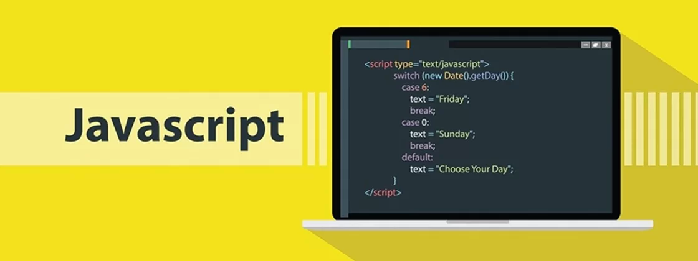

<p align="center">
  
</p>

## 🚀 Tecnologias

Esse projeto foi desenvolvido com as seguintes tecnologias:

- [HTML](https://developer.mozilla.org/pt-BR/docs/Web/HTML)
- [JavaScript](https://developer.mozilla.org/pt-BR/docs/Web/JavaScript)

## 💻 Projeto

Esse projeto tem como finalidade colocar em prática a lógica e algoritmos em JavaScript com diversas situações e dois desafios, ele foi elaborado na aula do programa Explorer da Rocketseat.

Durante o conteúdo foi visto sobre:

- Variáveis
- Operadores matemáticos
- Tipos de dados no JavaScript
- Operadores comparativos
- Estruturas de repetição e condicionais
- Arrays
- Funções

## :gear: Execução

Para executar o programa basta colocar o nome diretório no "src" do programa que deseja no script no HTML, exemplo:

```
<script src="01/js/main.js"></script>
```
Depois basta executar o arquivo HTML chamado de:

```
index.html
```